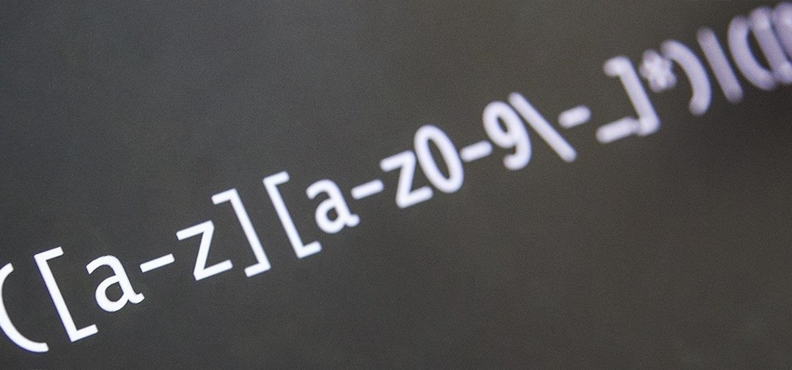

# RegEx
This repository contains a collection of RegEx notebooks/resources for one to perfect their Art of RegEx.

   

## Resources:
- https://developers.google.com/edu/python/regular-expressions
- https://developers.google.com/edu/python/exercises/baby-names (Exercise)

<!------>
